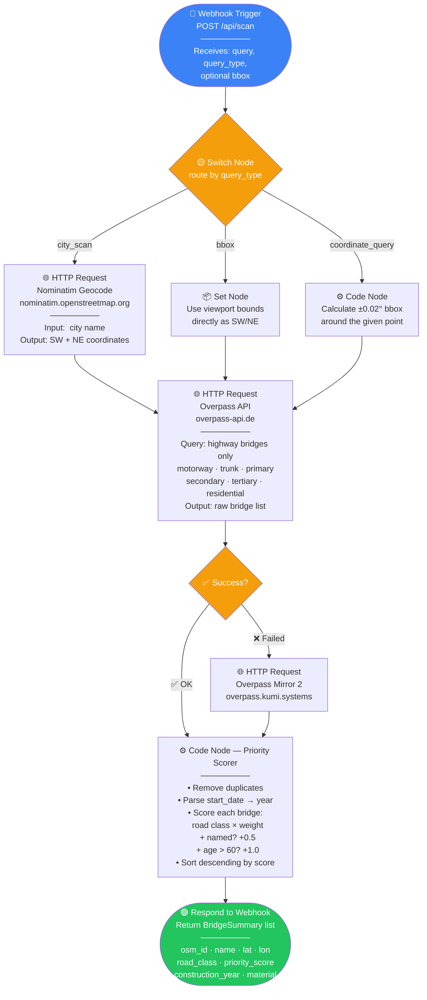
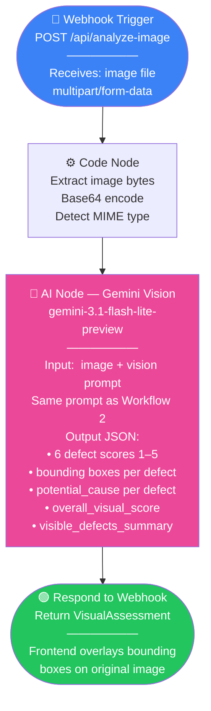

# DeepInspect — Agentic Workflow (n8n-style)

This document maps the DeepInspect system to a no-code workflow platform like n8n.
Each box is an **n8n node**. Arrows are connections. Parallel paths run simultaneously.

---

## Overview: Three Workflows

```
┌─────────────────────────────────────────────────────────────────────────┐
│  WORKFLOW 1 — Bridge Discovery          (instant, no AI)                │
│  Trigger: user searches city / scans viewport                           │
└─────────────────────────────────────────────────────────────────────────┘

┌─────────────────────────────────────────────────────────────────────────┐
│  WORKFLOW 2 — Deep Bridge Analysis      (15–30 sec, 3 AI agents)        │
│  Trigger: user clicks "Run Deep Analysis" on a bridge                   │
└─────────────────────────────────────────────────────────────────────────┘

┌─────────────────────────────────────────────────────────────────────────┐
│  WORKFLOW 3 — Uploaded Photo Analysis   (5–10 sec, 1 AI agent)          │
│  Trigger: user uploads a bridge photo                                   │
└─────────────────────────────────────────────────────────────────────────┘
```

---

## Workflow 1 — Bridge Discovery



**n8n nodes used:** Webhook · Switch · HTTP Request ×3 · Set · Code ×2 · Respond to Webhook

---

## Workflow 2 — Deep Bridge Analysis

This is the core AI pipeline. The Vision Agent and Context Agent run **in parallel**, then their results are merged for the Risk Agent.

```mermaid
flowchart TD
    A([🔵 Webhook Trigger\nPOST /api/bridges/osm_id/analyze\n——————\nReceives: BridgeSummary\n{osm_id, lat, lon, road_class,\nconstruction_year, material}])

    A --> B[📦 Set Node\nPrepare bridge data\nfor downstream nodes]

    B --> C{🔀 Split\nRun in parallel}

    %% ── VISION BRANCH ──────────────────────────────────────
    C -->|Branch A| D[🌐 HTTP Request ×3\nGoogle Street View Static API\n——————\nAngle 1: heading=0   North\nAngle 2: heading=90  East\nAngle 3: heading=270 West\nSize: 640×480 px\nCached to disk after first fetch]

    D --> E{🖼️ Got images?}
    E -->|❌ No coverage| F[📦 Set Node\nvisual = null\nstreet_view = none]
    E -->|✅ Yes| G[🤖 AI Node — Gemini Vision\ngemini-3.1-flash-lite-preview\n——————\nInput:  3 JPEG images + prompt\nPrompt: score 6 defect types 1–5\nOutput JSON:\n• cracking · spalling · corrosion\n• surface_degradation\n• drainage · structural_deformation\n• overall_visual_score 1.0–5.0\n• bounding boxes per defect\n• potential_cause per defect]

    G --> H[📦 Set Node\nVisual Assessment ready]
    F --> H

    %% ── CONTEXT BRANCH ─────────────────────────────────────
    C -->|Branch B| I[🤖 AI Node — Gemini Text\ngemini-3.1-flash-lite-preview\n——————\nInput:  bridge name + coords\n        OSM metadata\nPrompt: research Polish bridge\n        construction history\nOutput JSON:\n• construction_year\n• construction_era\n• material\n• past_incidents list\n• last_known_inspection\n• structural_significance]

    I --> J[📦 Set Node\nContext ready]

    %% ── MERGE ───────────────────────────────────────────────
    H --> K
    J --> K

    K[🔗 Merge Node\nWait for ALL branches\n——————\nCombines:\n  visual_assessment\n  bridge_context]

    K --> L[⚙️ Code Node — Risk Scorer\n——————\nWeighted formula:\n  Visual score   × 40%\n  Age score      × 25%\n  Incidents      × 20%\n  Inspection age × 15%\n= Final score 1.0–5.0\n\nTier mapping:\n  ≥4.0 → CRITICAL\n  ≥3.0 → HIGH\n  ≥2.0 → MEDIUM\n  else → OK]

    L --> M[🤖 AI Node — Gemini Text\ngemini-3.1-flash-lite-preview\n——————\nInput:  visual JSON + context JSON\n        computed score + tier\nPrompt: senior structural engineer\n        writing assessment\nOutput JSON:\n• condition_summary\n• key_risk_factors list\n• recommended_action\n• maintenance_notes list\n• confidence_caveat]

    M --> N[⚙️ Code Node\nBuild final BridgeRiskReport\nmerge all fields]

    N --> O([🟢 Respond to Webhook\nReturn BridgeRiskReport\n——————\nrisk_tier · risk_score\ncondition_summary\nkey_risk_factors\nrecommended_action\nvisual_assessment\ncontext · generated_at])

    style A fill:#3b82f6,color:#fff
    style O fill:#22c55e,color:#fff
    style C fill:#8b5cf6,color:#fff
    style K fill:#8b5cf6,color:#fff
    style G fill:#ec4899,color:#fff
    style I fill:#ec4899,color:#fff
    style M fill:#ec4899,color:#fff
```

**n8n nodes used:** Webhook · Set ×4 · HTTP Request ×3 · AI Node ×3 · If · Merge · Code ×2 · Respond to Webhook

---

## Workflow 3 — Uploaded Photo Analysis



**n8n nodes used:** Webhook · Code · AI Node · Respond to Webhook

---

## Complete System Architecture

```mermaid
flowchart LR
    subgraph Frontend["🖥️ Frontend (React + Leaflet)"]
        UI1[Search Bar]
        UI2[Map View\nLeaflet OSM]
        UI3[Bridge List\npriority sorted]
        UI4[Bridge Detail\npre / post analysis]
        UI5[Image Upload\nModal]
    end

    subgraph Backend["⚙️ Backend (FastAPI)"]
        direction TB
        EP1[POST /api/scan]
        EP2[POST /api/bridges\n/{osm_id}/analyze]
        EP3[POST /api/analyze-image]
        EP4[GET /api/demo]
        EP5[GET /api/images\n/{osm_id}/{heading}]
    end

    subgraph Agents["🤖 AI Agents (Gemini)"]
        AG1[Discovery Agent\nno AI]
        AG2[Vision Agent\nGemini Vision]
        AG3[Context Agent\nGemini Text]
        AG4[Risk Agent\nGemini Text]
    end

    subgraph External["🌐 External APIs"]
        EX1[OSM Overpass API\nbridge locations]
        EX2[OSM Nominatim\ncity geocoding]
        EX3[Google Street View\nbridge imagery]
        EX4[Gemini API\nAI analysis]
    end

    subgraph Storage["💾 Storage"]
        ST1[Street View\nDisk Cache]
        ST2[Redis\noptional]
        ST3[Demo Cache\nwroclaw.json]
    end

    UI1 -->|scan request| EP1
    UI2 -->|scan viewport| EP1
    UI4 -->|analyse bridge| EP2
    UI5 -->|upload photo| EP3

    EP1 --> AG1
    EP2 --> AG2
    EP2 --> AG3
    AG2 --> AG4
    AG3 --> AG4

    AG1 --> EX1
    AG1 --> EX2
    AG2 --> EX3
    AG2 --> EX4
    AG3 --> EX4
    AG4 --> EX4

    EX3 --> ST1
    EP2 --> ST2
    EP4 --> ST3

    style Frontend fill:#dbeafe
    style Backend fill:#fef9c3
    style Agents fill:#fce7f3
    style External fill:#dcfce7
    style Storage fill:#f3e8ff
```

---

## Data Flow Summary

```
USER TYPES "Warsaw"
       │
       ▼
[Webhook] ──► [Nominatim] ──► get city bbox
                                    │
                                    ▼
                            [Overpass API] ──► ~300 raw bridges
                                    │
                                    ▼
                            [Priority Scorer]
                              road class × weight
                              + named bonus
                              + age bonus
                                    │
                                    ▼
                            Return 300 BridgeSummary ──► GRAY DOTS on map

─────────────────────────────────────────────────────────────────────

USER CLICKS BRIDGE + "Run Deep Analysis"
       │
       ├──────────────────────────────────────────┐
       │                                          │
       ▼                                          ▼
[Street View API]                         [Gemini Text]
  fetch 3 angles                          research history
  N / E / W                               construction year
  cache to disk                           incidents
       │                                  material, era
       ▼                                          │
[Gemini Vision]                                   │
  score 6 defect types                            │
  draw bounding boxes                             │
  explain causes                                  │
       │                                          │
       └──────────────┬───────────────────────────┘
                      │
                      ▼
              [Risk Score Formula]
              visual × 40%
              age    × 25%
              history× 20%
              staleness×15%
              = score 1.0–5.0
                      │
                      ▼
              [Gemini Text]
              engineering report
              condition_summary
              key_risk_factors
              recommended_action
                      │
                      ▼
              Return BridgeRiskReport ──► COLOURED DOT on map
                                         full report in panel
```

---

## n8n Node Mapping Reference

| DeepInspect component | n8n node type | Notes |
|---|---|---|
| FastAPI endpoint | **Webhook** | One webhook per endpoint |
| `query_type` routing | **Switch** | Routes to city / bbox / coords branch |
| Nominatim geocode | **HTTP Request** | GET to nominatim.openstreetmap.org |
| Overpass query | **HTTP Request** | POST with OverpassQL body |
| Overpass fallback | **IF** + **HTTP Request** | Check status → try next mirror |
| Priority scoring | **Code** | JS/Python scoring formula |
| Street View fetch | **HTTP Request** | One node per heading, or loop |
| Gemini vision call | **HTTP Request** or **AI Agent** | POST to Gemini API with base64 images |
| Gemini text call | **HTTP Request** or **Basic LLM Chain** | POST to Gemini API |
| Parallel execution | **Split** at start, **Merge** at end | Set Merge mode to "Wait for all" |
| Risk formula | **Code** | Weighted arithmetic |
| Disk cache check | **IF** + **Read/Write File** | Check if `osm_id_heading.jpg` exists |
| Return response | **Respond to Webhook** | Send JSON back to frontend |
